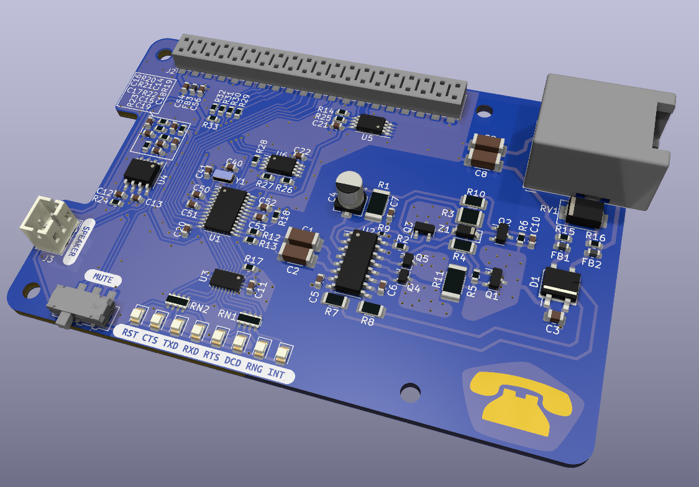

# Modem HAT for the Raspberry Pi

This HAT is a modem that connects the Raspberry Pi to a plain old analog telephone line.



The modem presents itself to the Raspberry Pi on UART4 and is controlled with the classic AT command set. It supports various standards (V.22bis, V.32bis, V.34, V.90, ...) at speeds of up to 56 kbps.

The design is based on a [Skyworks ISOmodem](https://www.skyworksinc.com/en/Products/Modems-and-DAAs/Data-and-Voice-Modems) chipset, specifically [Si2457](https://www.skyworksinc.com/en/Products/Modems-and-DAAs/Data-and-Voice-Modems/Si2457) data modem and Si3018 line side driver. The implementation
closely follows the circuits described in application note [AN93](https://www.skyworksinc.com/-/media/SkyWorks/SL/documents/public/application-notes/AN93.pdf).

**NOTE: Whatever your jurisdiction, we're pretty positive that connecting this device to the public phone system IS NOT LEGAL! Don't blame us if you get into trouble.**

## Raspberry Pi Configuration

The modem connects to the Raspberry Pi UART4 and requires CTS and RTS for flow control. To enable UART4 with CTS/RTS, edit `/boot/config.txt` and add the following line:

`dtoverlay=uart4,ctsrts`

After rebooting the Raspberry Pi, UART4 will be mapped to `/dev/ttyAMAx`, where `x` depends on the number of enabled UARTs. Typically, if only UART0 and UART4 are enabled, UART4 will be on `/dev/ttyAMA1`.

The modem is configured for automatic baudrate detection, supporting any standard DTE rate up to 307.2 kps.

## Modem Reset

Before first use after power-up, the modem must be reset by the Raspberry Pi.

To reset the modem, GPIO25 (pin 22) is set low for at least 500ms, then set high, followed by a delay of at least 300ms. This can be done with the following Python script.

```
import RPi.GPIO as GPIO
import time
GPIO.setmode(GPIO.BCM)
GPIO.setup(25, GPIO.OUT)
GPIO.output(25, GPIO.LOW)
time.sleep(0.5)
GPIO.output(25, GPIO.HIGH)
time.sleep(0.3)
```

By default, the modem is configured for operation in the United States. For other countries the modem will need to be reconfigured after reset. See [AN93](https://www.skyworksinc.com/-/media/SkyWorks/SL/documents/public/application-notes/AN93.pdf) chapter 6.2 for details. 

## AT Command Set

The modem supports the [basic Hayes command set](https://en.wikipedia.org/wiki/Hayes_command_set#The_basic_Hayes_command_set).

For a complete list of supported AT commands as well as configuration registers refer to [AN93](https://www.skyworksinc.com/-/media/SkyWorks/SL/documents/public/application-notes/AN93.pdf) chapters 5.4 through 5.7. 

## Raspberry Pi GPIO Pinout

Required connections:
|Pin|Description|
|-|-|
|1|3.3V power for modem chipset|
|2,4|5V power for audio amplifier|
|19|UART4 CTS|
|21|UART4 RX|
|22|Modem reset, RPi GPIO25|
|23|UART4 RTS|
|24|UART4 TX|

Optional connections:
|Pin|Description|
|-|-|
|13|Modem interrupt, RPi GPIO27|
|15|Modem boot config EEPROM SDIO, RPi GPIO22|
|16|Modem boot config EEPROM CS, RPi GPIO23|
|18|Modem boot config EEPROM CLK, Rpi GPIO24|
|27|RPi config EEPROM SDA|
|28|RPi config EEPROM SCL|

Usually the modem boot config and interrupt pins are not electrically connected to the Rasbperry Pi GPIO header. Populate R29-R32 with 0-ohm resistors to use these pins.

## Building Your Own HAT

### General

Large parts of the HAT are based on the hardware design reference in application note [AN93](https://www.skyworksinc.com/-/media/SkyWorks/SL/documents/public/application-notes/AN93.pdf) chapter 4. Where applicable, identical component designators are used to simplify cross-referencing. 

I used solder paste, stencil and reflow oven for assembly of my HAT. If you plan to hand-solder your unit, you may want to replace U3, the only QFN part, with a 74LVC541 in TSSOP-20 package.

For bring-up and troubleshooting of the modem portion of the circuit, refer to [AN93](https://www.skyworksinc.com/-/media/SkyWorks/SL/documents/public/application-notes/AN93.pdf) chapter 10.1. 

### Modem

The modem chipset consists of the digital part Si2457 (U1) and analog part Si3018 (U2).

These are expensive parts, costing US $13-$16 and $6-$8 respectively when purchased from reputable distributors. While tempting, beware of sources like Ebay and AliExpress as parts may be salvaged, old or even fake. It will be much easier to diagnose problems without having to second guess whether the core components of the HAT are genuine.

The HAT uses a 32.768 kHz crystal (Y1) to clock the Si2457, mainly chosen for small size and because I already had a few in my parts bin. The downside of this choice are the slow reset sequence (800 ms) and that this clocking option is only supported by Si2457 revision D or newer.

If you suspect that you're stuck with an old part, you could try using a 4.9152 MHz crystal instead. In that case you must remove R17 which configures the clock speed. You may also have to replace the load capacitors (C40, C41) with appropriate values. See [AN93](https://www.skyworksinc.com/-/media/SkyWorks/SL/documents/public/application-notes/AN93.pdf) chapter 4.1.3 for details.

On the analog side, most of the resistors, capacitors, diodes and transistors have critical voltage, current and/or power ratings. These are all called out in the schematic. See bill of material in [AN93](https://www.skyworksinc.com/-/media/SkyWorks/SL/documents/public/application-notes/AN93.pdf) chapter 4.3 for full details. 

Some resistors in the provided layout are higher power and therefore larger than needed due to availability when I built my board. When ordering parts, double-check the footprints and adjust the layout if needed. 

### Audio Output / Speaker

The audio output is optional and allows monitoring of connection progress via a speaker, and who doesn't  love the old-school sounds of two dial-up modems negotiating a session. It's half the reason to build this project! :)

The audio amplifier LM4819 (U4) can be substituted with the higher power, pin-compatible LM4862. Cheap, off-brand substitutes are probably fine too.

As alternative to the JST connector J3, a small speaker can be directly soldered to the pads and afixed to the circuit board with double-sided tape.

If this functionality is not needed, the audio amplifier (U4) and associated parts (C12-C19, R19-R24, SW1, J3) can be left unpopulated.

### Modem Boot Config EEPROM

The modem boot config EEPROM is optional and can store AT commands that the modem automatically runs after reset. See [AN93](https://www.skyworksinc.com/-/media/SkyWorks/SL/documents/public/application-notes/AN93.pdf) chapter 2.7 for details.

The EEPROM can be programmed by the modem with AT commands. For hacking, the EEPROM can also be connected to the Raspberry Pi by populating R29, R30 and R31. For the latter, keep the modem in reset while interacting with the EEPROM. 

If this functionality is not needed, the EEPROM (U6) and associated parts (C22, R26, R27, R28) can be left unpopulated.

### Raspberry Pi HAT ID EEPROM

The HAT ID EEPROM is optional and can store information that allows the Raspberry Pi to recognize the HAT and load the required device tree overlay, i.e. automatically configure UART4 and other pins.

I haven't figured out the content for this EEPROM yet. Specification is [here](https://github.com/raspberrypi/hats/blob/master/eeprom-format.md). Contributions are welcome :)

If this functionality is not needed, the EEPROM (U5) and associated parts (C21, R14, R25) can be left unpopulated.
